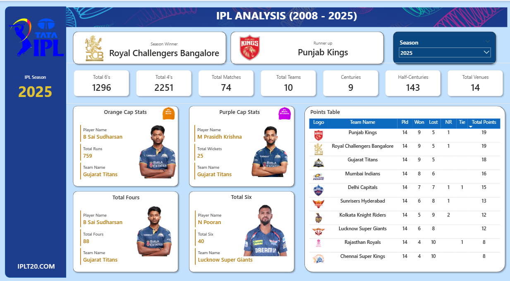

# 🏏 IPL Analysis Dashboard (2008–2025) | Power BI

## 📌 Overview

This project is an interactive **IPL (Indian Premier League) Analysis Dashboard** built using **Power BI**, covering seasons from **2008 to 2025**.

It provides insights into:

* Match statistics
* Team performance
* Player achievements (Orange Cap & Purple Cap)
* Season-wise comparisons

---

## 🎯 Key Features

### 📊 Season Insights

* Total Matches Played
* Number of Teams
* Total Venues
* Total 4’s & 6’s
* Centuries & Half-Centuries

### 🏆 Performance Highlights

* 🥇 Season Winner
* 🥈 Runner-up

### 🧢 Player Stats

* **Orange Cap Holder** (Most Runs)
* **Purple Cap Holder** (Most Wickets)
* Top performers in:

  * Total Fours
  * Total Sixes

### 📈 Points Table

* Matches Played
* Wins / Losses
* Net Results
* Total Points
* Team rankings

### 🔄 Dynamic Filtering

* Select any season (2008–2025)
* Dashboard updates instantly with relevant data

---

## 🛠️ Tools & Technologies Used

* **Power BI Desktop**
* Data Modeling
* DAX (Data Analysis Expressions)
* Data Visualization Techniques

---

## 📷 Dashboard Preview

### 🔹 2025 Season Overview




## 📂 Project Structure

```
📁 IPL-Analysis-PowerBI
 ┣ 📁 images
 ┣ 📄 IPL_Dashboard.pbix
 ┣ 📄 README.md
```

---

## 🚀 How to Use

1. Download the `.pbix` file
2. Open in **Power BI Desktop**
3. Use the **Season filter** to explore different years

---

## 📌 Insights Example

* Compare performance trends across seasons
* Identify top players and consistent teams
* Analyze scoring patterns (4s vs 6s)

---

## 🤝 Contributing

Feel free to fork this repository and improve the dashboard or add new insights.

---

## 📬 Contact

If you liked this project, feel free to connect with me on LinkedIn!

---

⭐ Don’t forget to star this repo if you found it useful!
